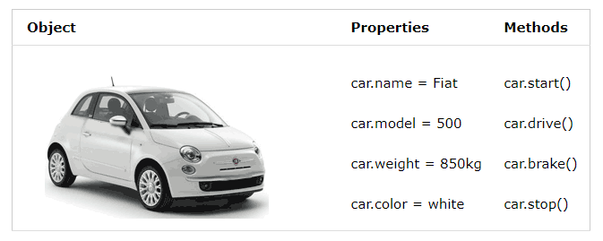

## Brief

### Lesson Overview

This lesson will be focusing on arrays and objects. Two data structures that are commonly used in projects. The learners will learn how to create and manipulate arrays and objects throughout the lesson. 

---

## Part 1 - What is an Array

If there is a list of items (a list of car names, for example), storing the cars in single variables could look like this:

```js
let car1 = "Saab";
let car2 = "Volvo";
let car3 = "BMW";
```

However, what if there is a need to loop through the cars and find a specific one? 
What if there are 300 cars, instead of 3?

The solution is to use an array.

An array can hold many values under a single name, and values can be accessed by referring to an index number.

Arrays are generally described as "list-like objects"; they are basically single objects that contain multiple values stored in a list. 

More often, they contain values that are related to each other and belong to the same data type.

*Note: In JS, you can have arrays containing values of different data types but it is a good practice to have values of the same data type*

### Creating an array and accessing values in an array.

Arrays are denoted by square brackets([]), and each element is separated by commas.

```js
const myArray = [1, 2, 3, 4, 5];
```

Another way is to use the `new` keyword and the Array constructor.

```js
const anotherArray = new Array(1, 2, 3, 4, 5, 6);
```

An empty array can also be created and added values to by specifying the index of the array.

```js
const yetAnotherArray = []; //empty array
yetAnotherArray[0] = 1;
yetAnotherArray[1] = 2;
yetAnotherArray[2] = 3;
```

Accessing an array element can be done by referring to its index number. Imagine array indexes as addresses of each element inside the array.

Array indexes start with 0. 

[0] is the first element, [1] is the second element, and so on.


```js
console.log(myArray);
console.log(myArray[0]);
console.log(myArray[3]);
```

### Array properties and methods

Array have several properties and methods that can be used to manipulate and check content.

To check the number of elements in an array, the `length` property is used.

```js
console.log(myArray.length);
```

To check if an element exists in the array, the `includes` method can be used. It returns true or false depending if the element exists or not.

```js
console.log(myArray.includes(5));
```

The index of an element can also be checked using the `indexOf` method. It returns the index of the element if found, and -1 if not found.

```js
console.log(anotherArray.indexOf(3));
console.log(anotherArray.indexOf(7));
```

Adding more elements can be done using the `push` method. The new element is always placed at the end of the array.

```js
myArray.push(8);
console.log(myArray);
```

The `pop` method removes the last element of the array. It returns the value of the element it removed.

```js
let lastElement = yetAnotherArray.pop();
console.log(lastElement);
console.log(yetAnotherArray);
```

Elements can also be added at the start of the array. This can be done using the `unshift` method.

```js
yetAnotherArray.unshift(0);
console.log(yetAnotherArray);
```

Elements at the start of the array using the `shift` method. 

```js
let firstElement = anotherArray.shift();
console.log(firstElement);
console.log(anotherArray);
```

### Mini activity

The instructor will be group the class into groups of 3 to 4 people per group.

Discuss within the group what the following array methods do and provide a simple example for each.
- join()
- concat()
- slice()
- splice()
- delete()
- map()

### Looping through array elements

Elements in an array can be done using for loops. There are also special for loops that can be used to loop through the elements
- for-in - reads the index of the array
- for-of - reads through elements of the array.

```js
const fruits = ["apple", "banana", "cranberry"];

// 1. The traditional for loop
for (let i = 0; i < fruits.length; i++) {
  console.log("1.", fruits[i]);
}

// 2. For In syntax
for (idx in fruits) {
  console.log("2.", idx);
}

// 3. For Of syntax
for (fruit of fruits) {
  console.log("3.", fruit);
}
```
---

## Part 2 - What are Objects

An object is a collection of related data and/or functionality. These usually consist of several variables and functions (which are called properties and methods when they are inside objects).

For example, in real life, a car is an object.

A car has properties like weight and color, and methods like start and stop. All cars have the same properties, but the property values differ from car to car. All cars have the same methods, but the methods are performed at different times.



### Creating objects

To create an object in JavaScript, the object literal ({}) can be used. Properties and values can then be provided in the form of key-value pairs.

The values can range from primitive data types to non-primitive data types and even methods (functions).

```js
const person = {
    name: "Brandon Smith",
    age: 28,
    occupation: "Chef",
    hobbies: ["Swimming", "Cooking", "Travelling"],
    isMarried: false,
    intro: function (){
        console.log(`Hi! My name is ${this.name}, and I'm a ${this.occupation} who's learning how to code. Nice to meet you!`);
    }
}
```

There are other ways of creating objects, but for the lesson, we will be focusing on using object literals.

The `this` keyword refers to the object itself. This is useful in reading an object's properties within the object.

```js
console.log(`Hi! My name is ${this.name}, and I'm a ${this.occupation} who's learning how to code. Nice to meet you!`);
```

### Accessing Object Properties and Methods

To access an object's property, use either of the following:

```
object.propertyName

OR 

object["propertyName"]
```

```js
console.log(`Age of person: ${person["age"]}`);
console.log(`First hobby of person: ${person.hobbies[0]}`);
```

To use a method of the object, use the dot notation. Functions and methods will be discussed further in the next lesson.

```js
person.intro();
```

### Looping through keys and values

The for-in loop can be used to read through the properties and values of the array.

```js
const pet = {
    name: "Cheddar",
    species: "cat",
    age: 4,
    breed: "Bengal / Persian"
}

for (key in pet){
    console.log(`Pet ${key} is ${pet[idx]}`);
}
```

---
